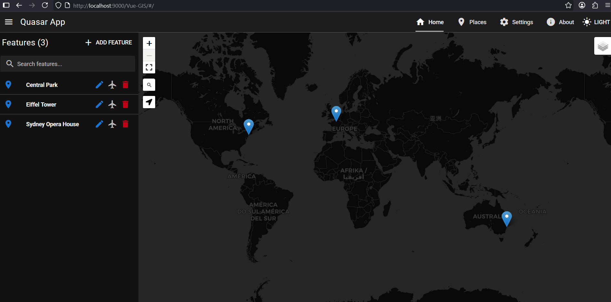
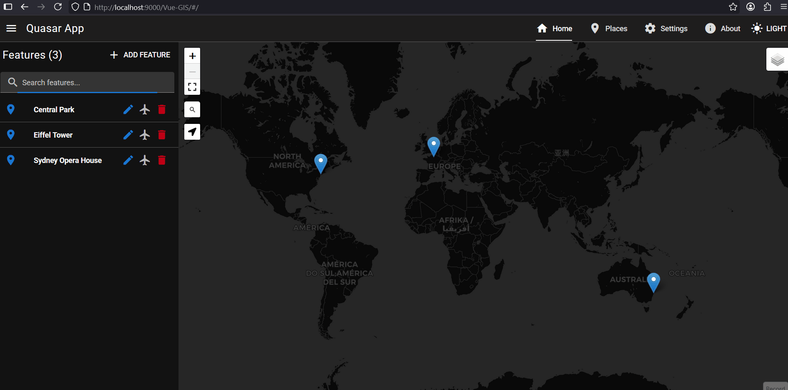
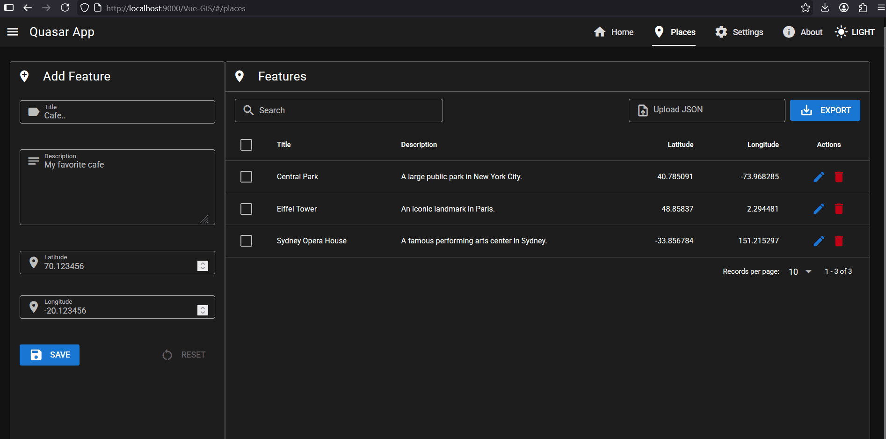

# Vue GIS

A GIS app built using Vue, Quasar and Leaflet

* [Vue.js 3](https://vuejs.org/)
* [Quasar Framework](https://quasar.dev/)
* [Dexie JS](https://dexie.org/)
* [Pinia](https://pinia.vuejs.org/)
* [VueUse](https://vueuse.org/)
* [Leaflet JS](https://leafletjs.com/)
* [Tanstack Vue-Form](https://tanstack.com/form/latest)
* [Zod](https://zod.dev/)


### Live Preview

[Vue GIS App](https://moustafa-shaaban.github.io/Vue-GIS/)


###  Project Goals

* Create, Read, Update and Delete (CRUD) geo features.

* Persist features data using the Dexie js (web browser IndexedDB).

* Search for features by feature title or description.

* Import/Export data.


### Project Reviews

* Project Review:


* Creating Features:


* Update and Deleteing Features:


* Form Validation:



* Filtering Features:


* Change Themes:



* Data Sync accross browser tabs:


* Data Export, Bulk Deleting and Data Import:



-------------------------------------------------


## Install the dependencies

```bash
bun install
```

### Start the app in development mode (hot-code reloading, error reporting, etc.)
```bash
bun run dev
```


### Build the app for production
```bash
bun run build
```
